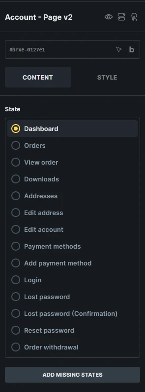

Displays the WooCommerce My Account page as editable endpoint states with shared account navigation.

:::note
This element requires **Bricks > Settings > WooCommerce > Enable advanced modular elements**.
:::

## Where this element works

My Account page.

## Key settings

- **State** (radio) - Switches the builder preview between My Account endpoint states.
- **Direction** (direction)
- **Gap** (number)
- **Disable navigation** (checkbox)
- **Navigation** style controls
- **Content** style controls

## States

- **Dashboard**
- **Orders**
- **View order**
- **Downloads**
- **Addresses**
- **Edit address**
- **Edit account**
- **Payment methods**
- **Add payment method**
- **Login**
- **Lost password**
- **Lost password (Confirmation)**
- **Reset password**
- **Order withdrawal** (requires WooCommerce 11.1 or later with Order Withdrawal enabled)

## Generated structures

Each state can generate a complete starter block for that endpoint from **Insert a structure**.

Generated structures are appended to the current state content and do not overwrite existing content.

:::note
Account Page v2 uses support elements for generated account forms and account orders pagination. Account orders, downloads, addresses, and order actions use v2 query loops and dynamic tags inside the matching account state. If you cannot find a support element in the regular Elements panel, use **Insert a structure** and then edit the generated element in the Structure panel.
:::

## Add missing states

If an expected state element is missing, select **Account - Page v2** and click **Add missing states**. Bricks checks all currently available account states and appends any missing state elements without replacing existing states or their content. This can restore an unexpectedly missing state or add a state introduced after the page was built.

The button appears only when states are missing and your builder permissions allow adding elements. States that depend on a disabled WooCommerce feature are excluded. For an Account Page v2 inside a component, edit the component definition to repair its states.

Added states start empty. Select each added state and use **Insert a structure** to generate its starter content. This tool does not restore deleted custom layouts or refill existing empty states; generate content inside an empty state separately.

## Order withdrawal

This public state requires WooCommerce 11.1 or later with **Order Withdrawal** enabled under **WooCommerce > Settings > Advanced > Features**. It lets guests and logged-in customers enter, review, and confirm a withdrawal request.

Select **Order withdrawal (State)** and generate **Complete order withdrawal block** under **Insert a structure**. If the state is missing, use **Add missing states** first. The generated block includes **Your details**, **Review**, and **Confirmation** sections. All three appear together with sample data in the builder; their **Order withdrawal screen** conditions select the matching section on the frontend.

Keep the generated **Account order withdrawal form** wrappers, submit buttons, and screen conditions when customizing the layout. WooCommerce handles validation and submission. Use the [withdrawal dynamic tags](/integrations/woocommerce/woocommerce-v2-query-loops-dynamic-tags/#order-withdrawal-tags) to display submitted details. A missing or empty withdrawal state falls back to WooCommerce's native form.

Add a visible link using `{woo_url:order-withdrawal}` so customers can find the endpoint; WooCommerce does not add one automatically. A withdrawal request does not cancel an order or issue a refund.

## Field maintenance

The Edit address state can audit and sync generated account address fields against the current WooCommerce account address field registry.

Use the field maintenance actions after plugins or WooCommerce settings change account address fields:

- **Check address fields**
- **Generate missing fields**
- **Remove invalid fields**
- **Remove duplicate fields**

## Query loops and dynamic data

Account Page v2 supports WooCommerce v2 query loops for account orders, order actions, account downloads, and account addresses.

Use account and order tags such as `{woo_account_address_title}`, `{woo_account_address}`, `{woo_order_number}`, `{woo_order_view_url}`, `{woo_order_download_name}`, and `{woo_order_action_url}` in the matching state or query loop.

See [WooCommerce v2 query loops and dynamic tags](/integrations/woocommerce/woocommerce-v2-query-loops-dynamic-tags/#account-tags) for the complete reference.

## Usage tips

- Use [WooCommerce advanced modular elements](/integrations/woocommerce/advanced-modular-elements/) or the [Woo Setup Wizard](/integrations/woocommerce/woo-setup-wizard/) to create the recommended Account Page v2 structure.
- Review each state after setup so logged-in, logged-out, password reset, payment method, and order views all match your store design.
- Use the classic [WooCommerce Account Builder](/integrations/woocommerce/woocommerce-account-builder/) workflow if you prefer separate endpoint templates.
